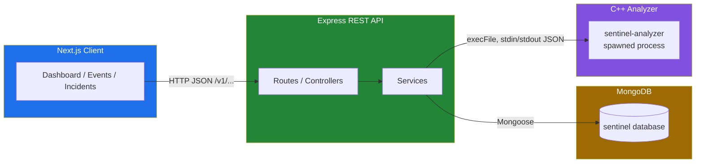

# Sentinel

**Status: in development — PLA submission**

Sentinel is a locally-executed Security Operations Centre (SOC) application built as a Prior
Learning Assessment for **ICS 214** (advanced C++ / object-oriented programming) and **ICS 221**
(web services). It ingests structured security-event data, correlates it in a C++ analysis
engine, applies configurable detection rules, persists the resulting incidents through a REST
API, and presents them in a minimal web dashboard.

## Architecture

The client never talks to MongoDB or the C++ analyzer directly — all persistence goes through
the API, and all analysis logic lives in C++, invoked by the API as a spawned child process.



The client only ever calls the API. The API is the sole caller of both MongoDB and the analyzer
binary; the analyzer has no network access and no persistence layer of its own — it reads event
JSON, evaluates detection rules, and returns incident JSON.

## Technology stack

| Layer | Technology |
|---|---|
| Analysis engine | C++20, CMake, CTest, Catch2, nlohmann/json |
| API | Node.js, Express, TypeScript, Mongoose, Zod |
| Persistence | MongoDB |
| Client | Next.js, TypeScript, TailwindCSS |

## Detection rules

| Rule ID | Condition | Severity | Score |
|---|---|---|---|
| `REPEATED_AUTH_FAILURE` | ≥10 failed auth events from one source within 120s | HIGH | 80 |
| `SUCCESS_AFTER_FAILURES` | A success following ≥5 failures against the same account/source inside the 5-minute analysis window | HIGH | 90 |
| `MULTI_ACCOUNT_PROBE` | Failed auth against ≥5 distinct accounts from one source within 180s | MEDIUM | 65 |

Rule thresholds, severities, and scores are configured in `config/rules.json`, not hard-coded in
the C++ engine.

## REST API

All endpoints are versioned under `/v1`.

| Method | Path | Purpose |
|---|---|---|
| GET | `/v1/events` | List ingested security events |
| POST | `/v1/events` | Submit one or more security events |
| GET | `/v1/incidents` | List incidents produced by analysis |
| GET | `/v1/incidents/:id` | Fetch a single incident |
| POST | `/v1/incidents/analyze` | Run the analyzer against stored events and persist resulting incidents |
| PATCH | `/v1/incidents/:id/status` | Update incident status (`Open` / `Investigating` / `Closed`) |
| DELETE | `/v1/incidents/:id` | Delete an incident |
| GET | `/v1/health` | Service health check |

Full request/response schemas are in `docs/openapi.yaml`.

## Repository layout

```
sentinel/
  analyzer/            C++20 analysis engine (CMake project)
    include/sentinel/   Public headers — class declarations
    src/                Implementation files, entry point
    tests/              Catch2 unit tests
  api/                 Express + TypeScript REST API
    src/
      controllers/       Request handlers (thin, delegate to services)
      routes/            Express route definitions
      models/            Mongoose schemas
      services/          Business logic + analyzer process integration
      middleware/         Error handling, cross-cutting concerns
      config/            Environment/config loading
      types/             Shared TypeScript types
    tests/               API tests
  client/              Next.js dashboard
    app/                 App Router pages
    components/          Reusable UI components
    lib/                 API client, shared types
  sample-data/         Synthetic event datasets for exercising each rule
  config/              Shared runtime configuration (rules.json)
  docs/                Design docs, data contract, OpenAPI spec
  tests/               Cross-component / integration tests
  scripts/             Dev and build helper scripts
  .vscode/             Editor tasks, launch configs, recommended extensions
```

## Getting started

**Status: work in progress.** The steps below describe the intended final workflow; the project
does not yet build or run end-to-end.

### Prerequisites (macOS, Homebrew)

```bash
xcode-select --install          # Xcode Command Line Tools
brew install cmake
brew install node                # Node LTS
brew tap mongodb/brew
brew install mongodb-community
```

### Build and run — analyzer

```bash
cd analyzer
cmake --preset debug
cmake --build --preset debug
ctest --preset debug
```

### Build and run — API

```bash
cd api
cp .env.example .env
npm install
npm run dev
```

### Build and run — client

```bash
cd client
cp .env.local.example .env.local
npm install
npm run dev
```

MongoDB must be running locally (`brew services start mongodb-community`) before starting the API.

## Sample data

Located in `sample-data/`, each dataset is designed to exercise a specific rule (or none):

| File | Exercises |
|---|---|
| `normal-events.json` | No rule — routine traffic below every threshold |
| `authentication-attack.json` | `REPEATED_AUTH_FAILURE` |
| `success-after-failures.json` | `SUCCESS_AFTER_FAILURES` |
| `multi-account-probe.json` | `MULTI_ACCOUNT_PROBE` |
| `mixed-events.json` | Multiple rules embedded in general noise |
| `boundary-events.json` | `REPEATED_AUTH_FAILURE`'s exact threshold/window edges |
| `malformed-events.json` | Analyzer input validation / error handling |

See `sample-data/README.md` for exact counts, time deltas, and the reasoning behind each file.

## Scope note

This is a **defensive analysis exercise using synthetic data only**. There is no live network
traffic capture, no offensive tooling, and no real or production security logs anywhere in this
repository. All IP addresses use RFC 5737 documentation ranges and all usernames/hostnames are
fabricated.

## Academic context

This repository is coursework submitted as a Prior Learning Assessment (PLA) for ICS 214 and
ICS 221.
